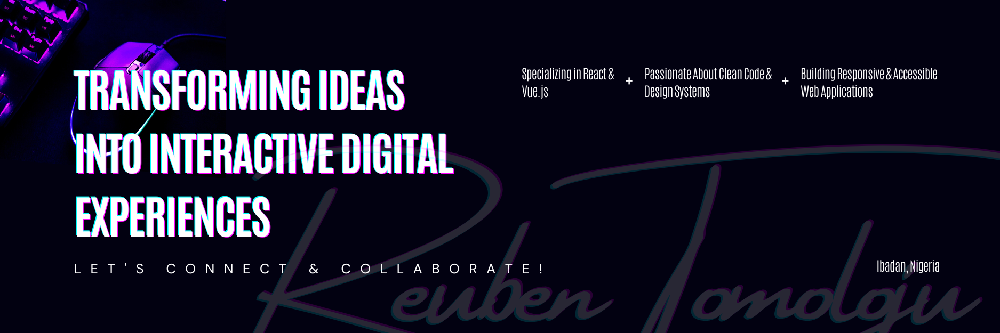

  
  
  <!-- <h4>📍 Nigeria | 📰 3 years experience | ✒️Front-End Developer  @Plugli LLC </h4> -->

  

    
    
    
    
    
</a>

    
    
    
    
    
    

    
    
    

 

#### About

Tech in Web and Mathematics | Frontend Developer | Contributing to communities by developing problem-solving products

Click for GitHub Stats

    
     
    

